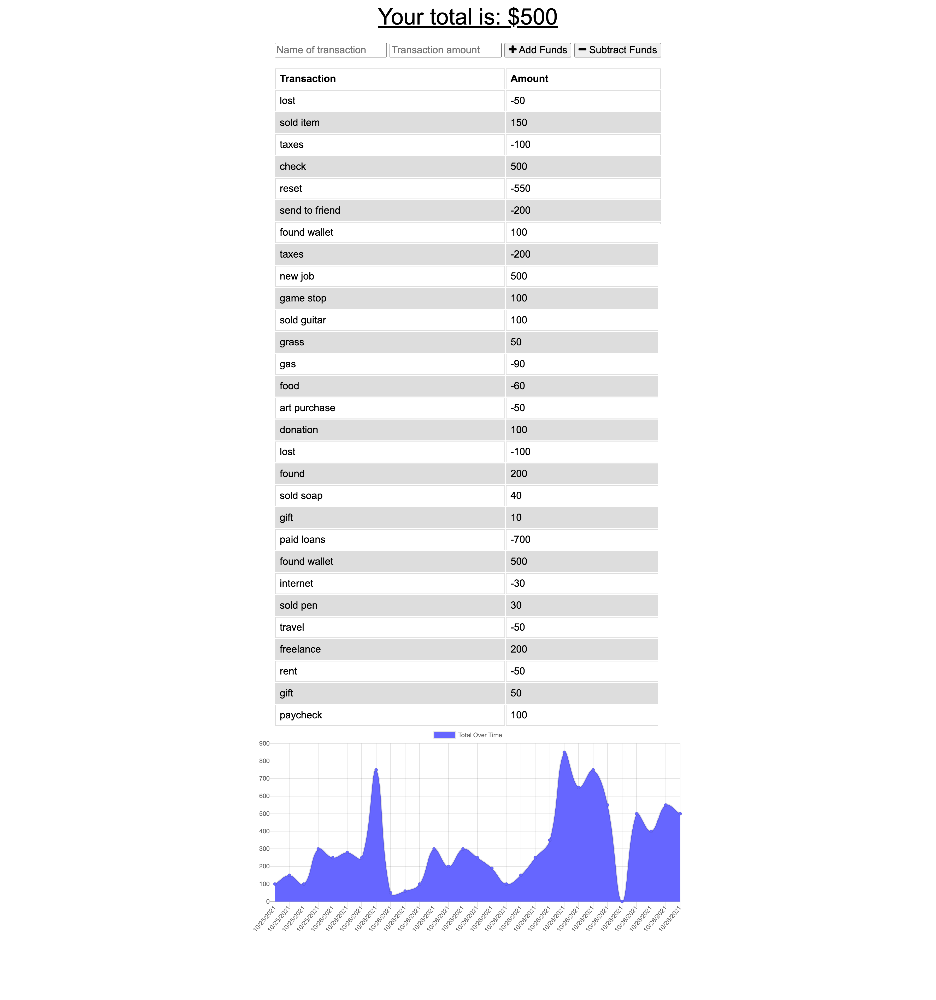

# budget-tracker
unlicensed
    
## Description
this is a budget tracker application to allow for offline access and functionality. The user will be able to add expenses and deposits to their budget with or without a connection. If the user enters transactions offline, the total should be updated when they're brought back online  
[project link](https://github.com/gfernandez25/budget-tracker)

## Table Of Contents
* [Installation](#user-content-installation)
* [Usage](#user-content-usage)
* [Licenses](#user-content-licenses)
* [Tests](#user-content-tests)
* [Questions](#user-content-questions)
    
## Installation
1. install npm compression
2. install npm express
3. install npm mongoose
4. install npm morgan
5. run npm start

## Usage
code can be downloaded from github and run from a local server or you can visit the deployed app on heroku\
[budget-tracker](https://shrouded-lowlands-98257.herokuapp.com/)

## Screenshot

## License

unlicensed
    
## Contributing
just contribute however you can
 
## Tests
manual test only

## Questions
for any questions please send me and email or check out my GitHub profile: [gfernandez25](https://github.com/gfernandez25)  

